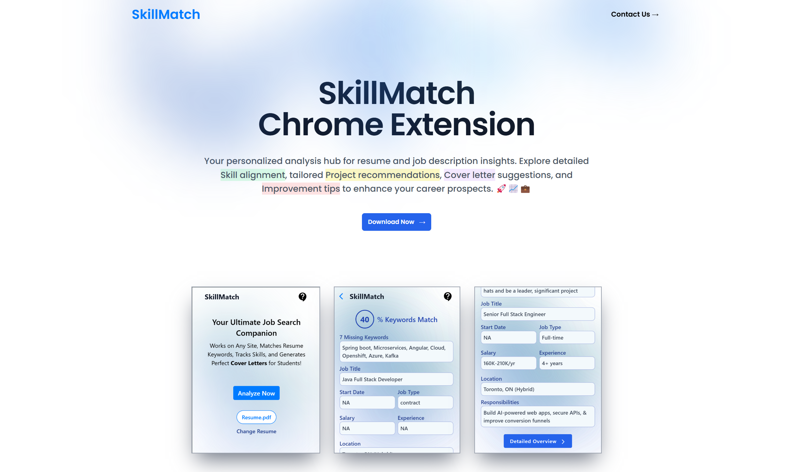
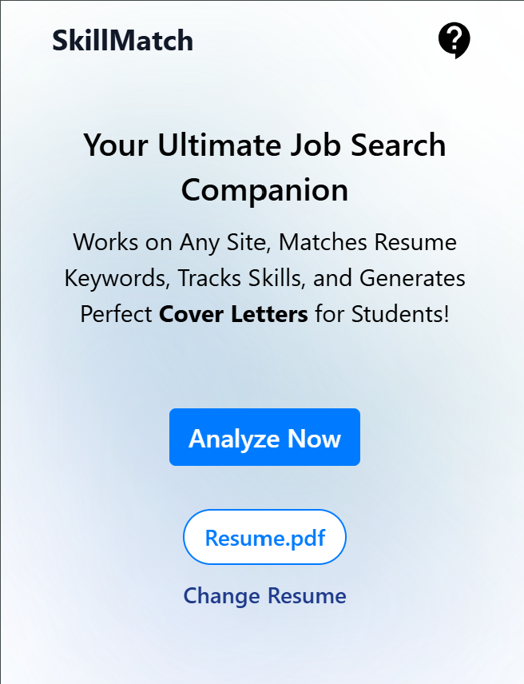
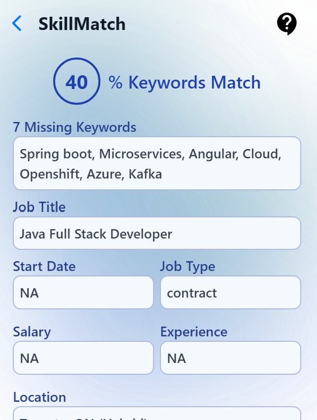
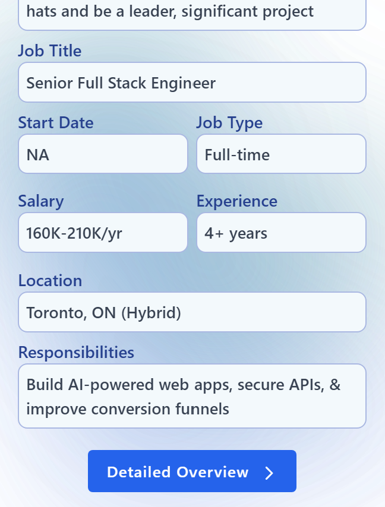
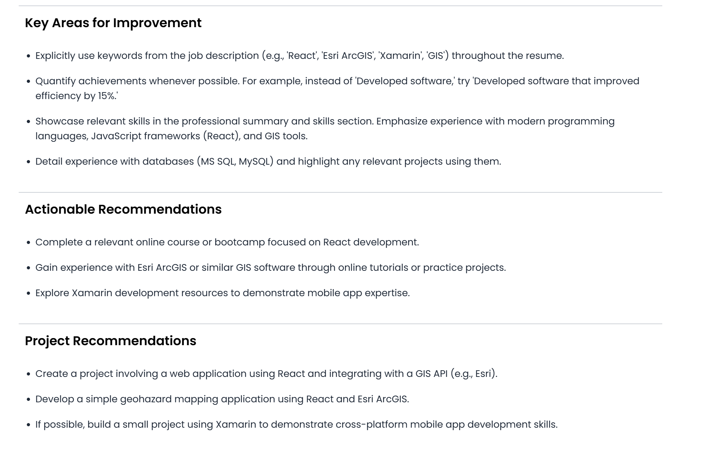

# SkillMatch Chrome Extension

SkillMatch is a personal project that simplifies job hunting by analyzing job descriptions and helping you optimize your resume. This repository contains the Chrome Extension and the Server that handles AI-powered analysis using the Google Gemini API.

## Screenshots

### Extension Interface


*The homepage of the SkillMatch Dashboard*


*The main interface of the SkillMatch Chrome Extension.*


*The page where you can analyze job descriptions.*


*Insights provided after analyzing a job description.*


*A detailed view of the analysis results.*


*Generate cover letters based on the analyzed job descriptions.*


*Extracted job details from the job description.*


## Features

- **Missing Keywords:** Get insights into what skills or phrases are missing in your resume.
- **Job Details:** Extract essential job information such as job title, salary, experience level, location, and more.
- **Responsibilities Breakdown:** Understand the role’s expectations with ease.

## How It Works

### Extension:

1. Submit your resume via the extension.
2. Navigate to any job description you're interested in.
3. Click Analyze, and SkillMatch provides insights, such as missing keywords and job details.

### Data Sync with Dashboard:

After analyzing a job description, the data is sent to the SkillMatch Dashboard for more detailed insights and cover letter generation.  

To see the dashboard and generate cover letters, check out Project 2: SkillMatch-Dashboard Repository.

## Technologies Used

- **React:** The front-end library for building the user interface in the extension.
- **Tailwind CSS:** A utility-first CSS framework for styling the extension.
- **Google Gemini API:** AI-powered insights for analyzing job descriptions and resumes.
- **Node.js / Express:** Server-side technology for handling requests.
- **Chrome Extension API:** For building the Chrome extension and interacting with the browser.

## Installation

1. **Clone the Repository:**

    ```bash
    git clone https://github.com/Sanjay-10/SkillMatch-Extension.git
    ```

2. **Set Up the Client (Extension):**

    Navigate to the skillmatch-extension folder:

    ```bash
    cd skillmatch-extension/client
    ```

    Install dependencies:

    ```bash
    npm install
    ```

    Run the extension:

    ```bash
    npm run start
    ```

3. **Set Up the Server:**

    Navigate to the server folder:

    ```bash
    cd server
    ```

    Install dependencies:

    ```bash
    npm install
    ```

    Set up your environment variables for Google Gemini API and any other API keys.

    Run the server:

    ```bash
    npm start
    ```

4. **Load the Extension in Chrome:**

    Open Chrome and go to `chrome://extensions/`.

    Enable Developer Mode in the top right.

    Click Load Unpacked and select the `skillmatch-extension` directory.


## Disclaimer

SkillMatch is a personal project. Please seek permission before using this software.    

